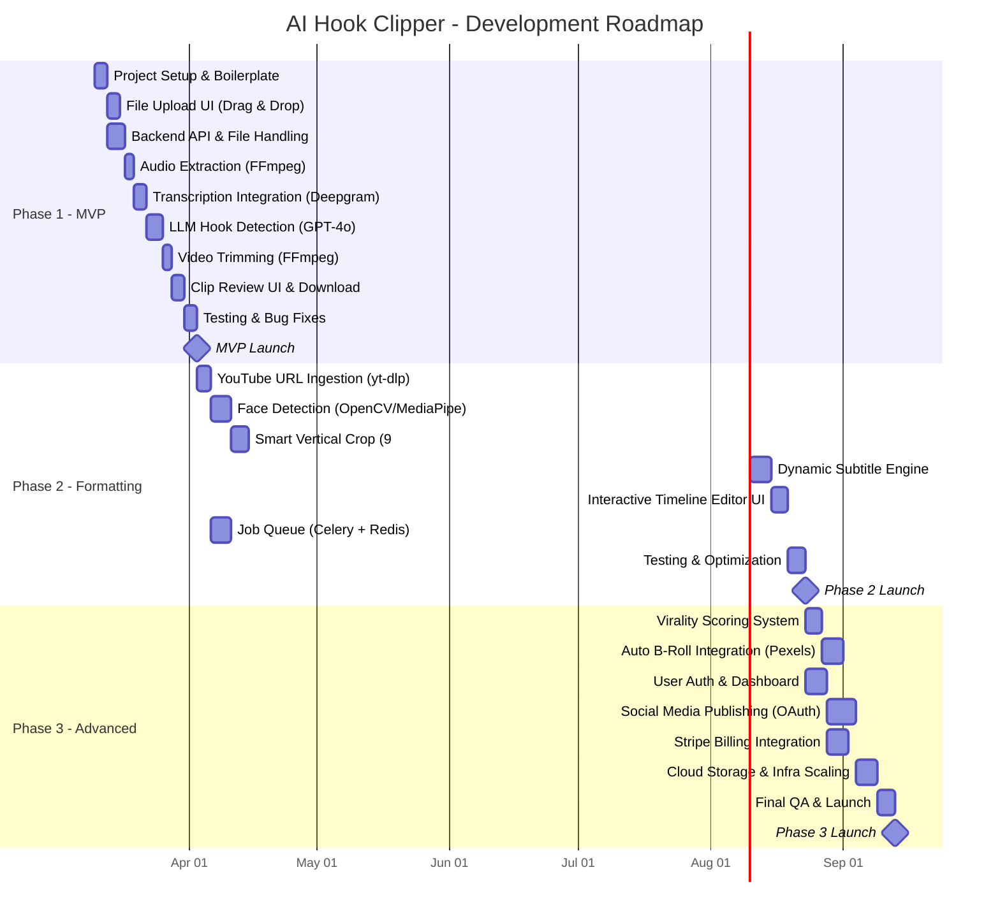

# Product Requirements Document: AI Hook Clipper

## 1. Product Overview
**Name:** AI Hook Clipper (working title)
**Description:** A web-based application that automatically ingests long-form video content (podcasts, streams, interviews), analyzes the audio/transcript using AI, and extracts the most engaging, viral-ready short clips (hooks) formatted for TikTok, YouTube Shorts, and Instagram Reels.
**Goal:** To drastically reduce the time content creators and marketers spend manually hunting for and editing short-form content from their long-form videos.

## 2. Target Audience
- Content Creators (YouTubers, Streamers, Podcasters)
- Social Media Managers & Marketers
- Digital Marketing Agencies

---

## 3. Development Roadmap

---

## 4. Phase Details

### Phase 1: Minimum Viable Product (MVP)
> **Duration:** ~4 weeks | **Goal:** Prove the core concept works end-to-end.

#### Sprint 1 (Week 1-2): Foundation & Pipeline

| Task | Description | Deliverable |
|---|---|---|
| **Project Setup** | Initialize Next.js frontend + Python FastAPI backend. Set up Docker, env variables, and folder structure. | Running dev environment |
| **File Upload UI** | Drag-and-drop upload component. Progress bar. File type validation (`.mp4`, `.mov`). Max size: 500MB. | Upload page |
| **Backend File Handling** | FastAPI endpoint to receive multipart uploads, validate, and store temporarily on disk. | `POST /api/upload` endpoint |
| **Audio Extraction** | Run `ffmpeg -i input.mp4 -q:a 0 -map a audio.mp3` server-side to extract audio track. | Audio extraction service |
| **Transcription** | Send extracted audio to Deepgram API. Parse JSON response containing word-level timestamps. | Transcription service |

#### Sprint 2 (Week 3-4): AI Analysis & Output

| Task | Description | Deliverable |
|---|---|---|
| **LLM Hook Detection** | Send full transcript to GPT-4o with a tuned prompt. Parse the structured JSON response for 3-5 hooks with `start_time`, `end_time`, and `title`. | Hook detection service |
| **Timestamp Validation** | Cross-reference LLM timestamps against actual transcript data. Snap to nearest valid word boundary if LLM hallucinates. | Validation logic |
| **Video Trimming** | Use `ffmpeg -ss [START] -to [END]` to extract each clip from the source video. | Trimming service |
| **Clip Review UI** | Dashboard showing each clip: embedded video player, hook title, transcript text, and download button. | Review page |
| **E2E Testing** | Test full pipeline with 5+ diverse videos (podcast, interview, lecture). Fix edge cases. | Tested MVP |

#### Phase 1 Deliverables
- ✅ Upload a video file
- ✅ AI finds 3-5 best hooks automatically
- ✅ Download trimmed 16:9 clips
- ✅ Basic but functional web UI

#### Phase 1 Risks & Mitigations
| Risk | Impact | Mitigation |
|---|---|---|
| LLM invents invalid timestamps | Clips cut at wrong points | Validate against transcript; snap to nearest word |
| Large file upload failures | Users can't upload | Limit to 500MB; add chunked upload later |
| Slow transcription for long videos | Bad UX | Show progress bar; use streaming transcription |

---

### Phase 2: Formatting & Polish — The "Viral" Upgrade
> **Duration:** ~5 weeks | **Goal:** Make clips platform-ready for TikTok, Shorts, and Reels.

#### Sprint 3 (Week 5-6): Ingestion & Face Tracking

| Task | Description | Deliverable |
|---|---|---|
| **YouTube URL Input** | Add URL text field. Backend uses `yt-dlp` to download video. Support YouTube, Twitch, Twitter/X. | URL ingestion endpoint |
| **Face Detection** | Run OpenCV/MediaPipe on each frame to detect face bounding boxes. Store coordinates per frame. | Face detection module |
| **Smooth Tracking** | Apply moving average filter to face coordinates to prevent jittery cropping. Handle multi-face scenarios (pick dominant/speaking face). | Tracking algorithm |
| **Job Queue Setup** | Implement Celery + Redis for background processing. All video jobs run async with status polling. | Queue infrastructure |

#### Sprint 4 (Week 7-8): Subtitles & Editing

| Task | Description | Deliverable |
|---|---|---|
| **Vertical Crop Engine** | Use face coordinates to dynamically crop each frame from 16:9 → 9:16. Render via `ffmpeg` crop filter. | Crop pipeline |
| **Subtitle Generator** | Convert word-level timestamps into `.ass` subtitle files. Support styles: bold highlight (Hormozi), word-by-word pop, classic bottom text. | Subtitle engine |
| **Subtitle Burn-in** | Run `ffmpeg -vf "ass=subs.ass"` to permanently overlay subtitles onto the cropped vertical video. | Final rendering pipeline |
| **Style Picker UI** | Dropdown/card selector for subtitle style. Live preview of font, color, size, and animation. | Style picker component |

#### Sprint 5 (Week 9): Timeline Editor & QA

| Task | Description | Deliverable |
|---|---|---|
| **Interactive Timeline** | Waveform-based slider to fine-tune clip start/end. Click "Re-render" to regenerate the clip with new boundaries. | Timeline editor component |
| **Performance Optimization** | Profile and optimize FFmpeg rendering pipeline. Target: < 30s render for a 60s vertical clip. | Optimized pipeline |
| **QA & Testing** | Test across various video types, aspect ratios, and audio qualities. Stress test queue system. | Stable Phase 2 release |

#### Phase 2 Deliverables
- ✅ Paste a YouTube link to get clips
- ✅ Auto vertical cropping with face tracking
- ✅ Dynamic animated subtitles (multiple styles)
- ✅ Manual timeline adjustment
- ✅ Background job processing (async)

#### Phase 2 Risks & Mitigations
| Risk | Impact | Mitigation |
|---|---|---|
| Multiple speakers cause crop jitter | Bad visual quality | Detect active speaker via audio; fallback to center crop |
| High CPU cost for face tracking | Slow renders, server strain | Offload to Celery workers; process every Nth frame and interpolate |
| `yt-dlp` breaks with site updates | URL ingestion fails | Pin `yt-dlp` version; monitor for updates; add fallback error message |

---

### Phase 3: Advanced Features, Automation & Monetization
> **Duration:** ~6 weeks | **Goal:** Build a subscription-worthy product that fully automates the content pipeline.

#### Sprint 6 (Week 10-11): Intelligence & B-Roll

| Task | Description | Deliverable |
|---|---|---|
| **Virality Scoring** | Secondary LLM prompt with a rubric (hook strength, emotional valence, retention probability). Returns a score 1-100 + explanation per clip. | Scoring module |
| **Score UI** | Display virality score as a visual gauge/badge on each clip card. Show reasoning tooltip on hover. | Score UI component |
| **B-Roll Keyword Extraction** | LLM identifies visual keywords + timestamps (e.g., "money" at 00:32-00:35). | Keyword extraction service |
| **B-Roll Fetching & Overlay** | Query Pexels API for stock video matching keywords. Crop, trim, and layer over main clip using `ffmpeg -filter_complex`. | B-Roll pipeline |

#### Sprint 7 (Week 12-13): User System & Publishing

| Task | Description | Deliverable |
|---|---|---|
| **User Authentication** | Email/password + OAuth (Google, GitHub) login via Supabase Auth. | Auth system |
| **User Dashboard** | History of all processed videos and clips. Saved subtitle style presets. Cloud storage for rendered clips. | Dashboard page |
| **Social OAuth Setup** | Register developer apps with TikTok, YouTube, and Instagram. Implement OAuth2 token flow. | OAuth integrations |
| **Direct Publishing** | "Publish Now" and "Schedule" buttons on each clip. Celery scheduled tasks to post at the right time. | Publishing service |

#### Sprint 8 (Week 14-15): Billing & Infrastructure

| Task | Description | Deliverable |
|---|---|---|
| **Stripe Integration** | Tiered plans (Free: 10 mins/mo, Pro: 100 mins/mo, Agency: unlimited). Checkout, webhooks, and usage metering. | Billing system |
| **Infrastructure Scaling** | Migrate video rendering jobs to AWS ECS or MediaConvert. Auto-scaling worker pools based on queue depth. | Scalable infra |
| **Data Lifecycle Policies** | Auto-delete unrendered source files after 7 days. Compress and archive old clips. | Storage management |
| **Final QA & Launch** | Full regression testing. Load testing. Security audit. Documentation. | Production release |

#### Phase 3 Deliverables
- ✅ AI virality scoring for every clip
- ✅ Auto B-Roll insertion from stock footage
- ✅ User accounts with cloud storage
- ✅ Publish directly to TikTok, YouTube Shorts, Instagram Reels
- ✅ Stripe billing with tiered plans
- ✅ Scalable cloud infrastructure

#### Phase 3 Risks & Mitigations
| Risk | Impact | Mitigation |
|---|---|---|
| Social media API approval delays | Can't launch publishing feature | Apply early; build UI around "coming soon" if needed |
| Video storage costs explode | Unprofitable at scale | Enforce auto-delete policy; use Cloudflare R2 for cheaper egress |
| Stripe webhook failures | Billing inconsistencies | Idempotent webhook handlers; reconciliation cron job |

---

## 5. Technical Architecture & Stack
- **Frontend:** Next.js (React), Tailwind CSS, Zustand
- **Backend:** Python (FastAPI), Celery, Redis
- **Database:** PostgreSQL (Supabase)
- **File Storage:** AWS S3 or Cloudflare R2
- **AI/Media:** Deepgram/AssemblyAI, OpenAI API (GPT-4o), FFmpeg, OpenCV/MediaPipe

## 6. Key Success Metrics (KPIs)
| Metric | Target | Phase |
|---|---|---|
| Upload → Clips ready time | < 2 min (10-min video) | Phase 1 |
| Clip retention rate (clips downloaded / clips generated) | > 60% | Phase 1 |
| Render time for 60s vertical clip | < 30 seconds | Phase 2 |
| User activation (signed up → first clip) | > 40% | Phase 3 |
| Monthly Recurring Revenue (MRR) | $5K within 3 months of Phase 3 | Phase 3 |
| Processing error rate | < 2% | All |
